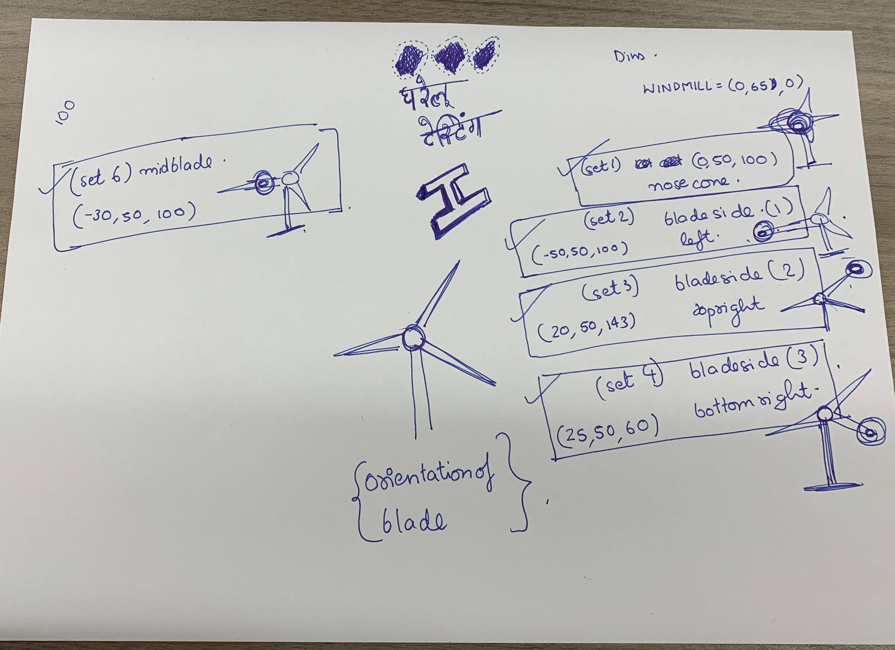

# MK1 

First try for implementing the 3 point dataset using simulated lidar readings. 

## Description 

- __p1__ : Segmentation + Isolation based on clusters using Region Growing. 
- __r1__ : A utility to get back coordinates of clicked points.